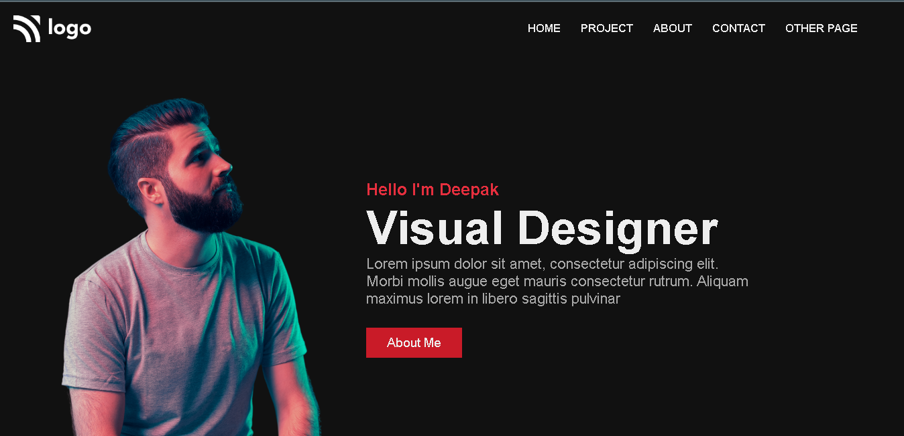

# Assignment-15

# Project [Deployed Link](https://deepakproject15.netlify.app)

- What I learned from this Project?
  - 
  - Learned how to make Portfolio website.
  - Learned how to make a full fledged website end to end. 
  - Learned about layouts making through Flexbox & Grid.
  - Learned how to create different type of cards.
  - How to display project on web-page and giving them border.
  - How to use different Google Fonts in webpage.
  - Learned how to make responsive web-design.
  
  

 
---

## Time taken to finish this project

- 4 hour to complete it.

---

## ScreenShot

